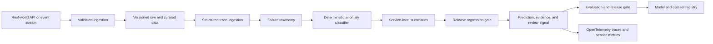

# Architecture

## Problem

Production AI teams need trace-level signals for latency, token growth, tool failures, and low-quality outputs.

## System Flow

## Components

- **Structured trace ingestion**
- **Failure taxonomy**
- **Deterministic anomaly classifier**
- **Service-level summaries**
- **Release regression gate**

## Recommended Production Stack

- OpenTelemetry GenAI semantic conventions
- OpenTelemetry Collector for vendor-neutral ingestion
- ClickHouse or PostgreSQL for trace analytics
- Prometheus and Grafana for service-level metrics
- MLflow for model and prompt version linkage
- FastAPI for trace search and regression APIs

## Hugging Face Tasks

- `text-classification`
- `token-classification`
- `summarization`
- `zero-shot-classification`

## Model Architecture

The included baseline is a transparent token-prototype model. Training builds
per-label token weights and inverse-document-frequency retrieval weights from
the synthetic training split. The runtime returns a prediction, confidence,
review flag, and evidence documents. This baseline is intentionally small so
it can run in CI without paid compute.

For production, compare it with domain embeddings, gradient-boosted models, or
fine-tuned transformer models using the same held-out evaluation contract.

## Production Boundaries

- Validate and version all input schemas.
- Keep human review for low-confidence or high-impact decisions.
- Store prompts, traces, model versions, and dataset versions together.
- Do not treat synthetic evaluation performance as production evidence.
- Add authentication, authorization, encryption, and retention controls.

## Known Risks

Thresholds are demonstration defaults and need calibration against each production workload.
